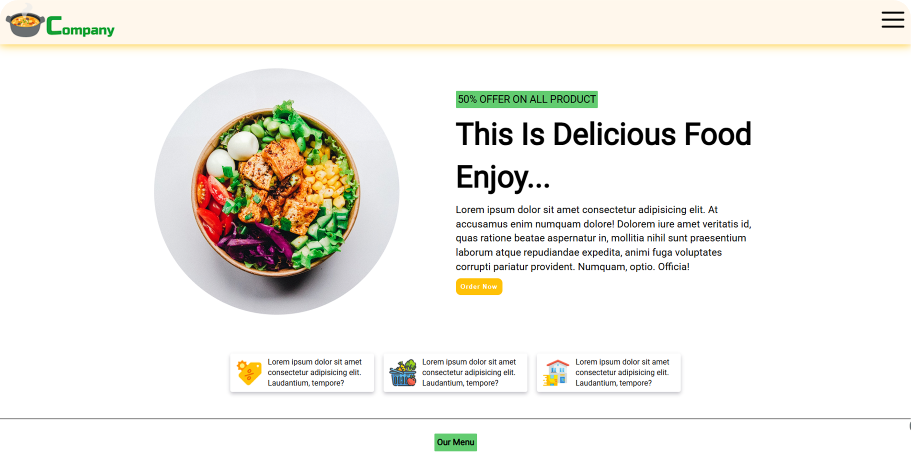

# Restaurant Website - [Live](https://restaurantwebsite212002.netlify.app/)

Welcome to the Restaurant Website project! This repository contains the code for my restaurant web application.

## About the Project

The Restaurant Website is a clean, modern, and responsive web application designed to showcase a restaurant's menu, location, and contact information. It provides an intuitive interface for users to explore the restaurant’s offerings and services.

## Screenshot



## Features

- **🍽️ Menu Display**: Browse the restaurant's menu with detailed descriptions and prices for each dish.
- **📍 Location & Map**: View the restaurant's location along with an interactive map for easy directions.
- **📞 Contact Information**: Easily find the restaurant's phone number, email, and address.
- **📱 Fully Responsive**: Optimized for seamless browsing on all devices, from desktops to smartphones.

## Technologies Used

- **Frontend**: HTML, CSS, JavaScript
- **Hosting**: Netlify

## How to Use

1. Clone this repository:
   ```bash
   git clone https://github.com/Prathmeshpawar21/Web-Dev-Restaurant.git
   ```
2. Navigate to the project directory:
   ```bash
   Web-Dev-Restaurant
   ```


## Deployment

This platform is hosted on Netlify. To deploy:
1. Link the repository to your Netlify account.
2. Push changes to the `main` branch, and Netlify will automatically deploy the updates.

---

Thank you for exploring my Restaurant Website! If you find this project helpful, please give it a ⭐ to show your support.
